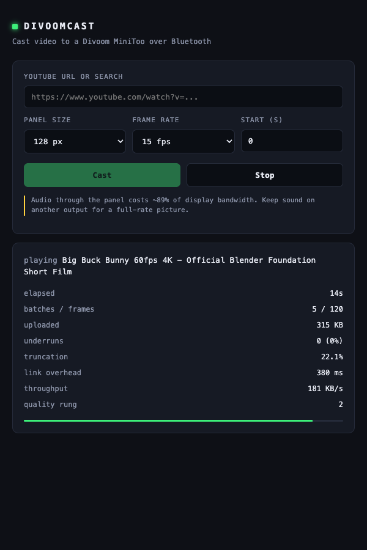

# divoom-cast

Cast images and video (including YouTube) to a **Divoom MiniToo** 128x128 pixel
panel from macOS, over Bluetooth.

Everything here was derived by measurement against real hardware. See
[docs/PROTOCOL.md](docs/PROTOCOL.md) for the wire format and
[docs/FINDINGS.md](docs/FINDINGS.md) for the performance results that shaped the
design.

## Quick start

```bash
python3 -m venv .venv && .venv/bin/pip install -e .
.venv/bin/divoomcast info                      # probe the link
.venv/bin/divoomcast send picture.png          # a still image
.venv/bin/divoomcast play "https://www.youtube.com/watch?v=..."
```

## Web UI and Chrome extension

Start the daemon, then open the UI or use the extension. Both drive the same
local API.

```bash
.venv/bin/divoomcast serve            # http://127.0.0.1:8787
```



**Extension:** `chrome://extensions` -> Developer mode -> Load unpacked ->
select `extension/`. On any YouTube watch page the popup casts from the video's
*current* playback position, so the panel picks up where you are.

### API

| method | path | body |
|---|---|---|
| GET | `/api/status` | live state + link telemetry |
| GET | `/api/ping` | liveness |
| POST | `/api/play` | `{url, size, fps, start, seconds}` |
| POST | `/api/stop` | |

## Status

| Capability | State |
|---|---|
| Still images | working |
| Video / YouTube streaming, no audio | working, 128px @ 15fps |
| Video with audio through the panel | severely limited, see below |
| Web UI + local API | working |
| Chrome extension (MV3) | working |

## The one thing to know

The MiniToo is a speaker as well as a display, and the two compete. Sustained
A2DP audio costs about **89% of the display bandwidth** (measured 156 KB/s down
to 12 KB/s, with round-trip latency rising ~6x). It recovers fully the moment
audio stops.

So: play your audio through a different output and send only video to the panel.
That keeps the full 128px @ 15fps picture. The Chrome extension is built around
this, your browser keeps the sound, the panel gets the picture.


## Tuning

Defaults are the measured optimum for a silent link at 128px. Worth knowing:

- `--size` must be a multiple of 16, max 128.
- `--fps` above ~15 needs heavy posterisation to fit the byte budget.
- `--level` is the zstd level. 9 is the sweet spot; 17 costs 7x the CPU for 12%.
- `--guard` overrides the adaptive margin. Larger means fewer underruns but more
  of each batch truncated. The two trade off directly.

## Development

```bash
.venv/bin/python -m pytest tests/ -q
```

The `codec` and `timing` modules have no hardware dependencies and are fully
unit-tested. `link`, `source` and `player` need a paired device.

## Credit

Protocol corroborated against
[alvinunreal/divoom-minitoo-osx](https://github.com/alvinunreal/divoom-minitoo-osx).
